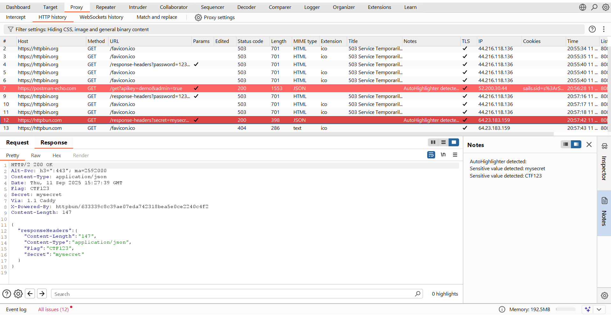

<h1 align="center">🔍 Auto Highlighter - Burp Suite Extension</h1>

<p align="center">
  <b>A lightweight Burp Suite extension that automatically highlights HTTP traffic to make sensitive findings stand out.</b>
</p>

<p align="center">
  
  
  
  
</p>

---

## ✨ Overview
**Auto Highlighter** is a Burp Suite extension designed for **security researchers and penetration testers**.  
It automatically highlights requests and responses containing sensitive keywords such as `password`, `token`, `apikey`, `secret`, `admin`, and more.  

This reduces manual searching effort and helps you quickly spot potential vulnerabilities.

---

## 🚀 Features
- 🎨 **Automatic Highlighting** – Sensitive keywords are highlighted in HTTP traffic.  
- ⚡ **Lightweight & Fast** – Minimal overhead, runs seamlessly inside Burp Suite.  
- 🛠️ **Customizable Rules** – Extend or modify keyword patterns in code.  
- 📋 **Auto Notes** – Adds notes to matched responses for quick reference.  

---

## 📦 Installation

1. Download the latest release JAR from the [Releases page](https://github.com/jagdishtripathy/AutoHighlighter/releases).  

2. In **Burp Suite**:  
   - Navigate to **Extender → Extensions → Add**  
   - Select the downloaded `.jar` file  
   - Click **Next** to load the extension  
3. Done ✅ — Auto Highlighter is now active.

---

## 📂 Project Structure
```
AutoHighlighter/
├── src/                # Source code
│   └── main/java/...   # Java classes (Burp Extender implementation)
├── pom.xml             # Maven build configuration
├── target/             # Compiled JAR files
├── README.md           # Documentation
└── LICENSE             # Open-source license
```
---

## 🖼️ Screenshots
 
Example:  


---

## 🧑‍💻 Development

To build from source:

```bash
git clone https://github.com/jagdishtripathy/AutoHighlighter.git
cd AutoHighlighter
mvn clean package
```

The compiled JAR will be available in:

```
target/AutoHighlighter-1.0.jar
```

---

## 📜 License
This project is licensed under the **MIT License** – see the [LICENSE](LICENSE) file for details.  

---

## 🤝 Contributing
Contributions are welcome! If you’d like to improve Auto Highlighter:

1. Fork the repo  
2. Create a feature branch (`git checkout -b feature/new-feature`)  
3. Commit your changes (`git commit -m "Add new feature"`)  
4. Push to your fork and open a Pull Request  

---

## 🌐 Links
- 🔗 [Burp Suite BApp Store](https://portswigger.net/bappstore) *(once approved)*  
- 📂 [Releases](https://github.com/jagdishtripathy/AutoHighlighter/releases)  

---

<p align="center">Made with ❤️ for the Security Community</p>
